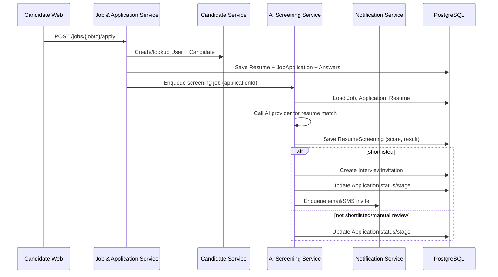

## Backend High Level Design (HLD) – Recruitment & AI Interview Platform

### 1. Scope & Goals
- **Scope**: Backend services for the multi-tenant Recruitment & AI Interview Platform (recruiters + candidates), including auth/RBAC, job board, applications, AI resume screening orchestration, AI DSA interview engine, proctoring, reporting, dashboards, and integrations.
- **Goals**: Be **API-first**, secure, multi-tenant, horizontally scalable, and easy to extend with new pipeline stages (MCQ, manual interviews, ATS integrations) without large rewrites.

---

### 2. Architecture Overview
- **Architecture style**: Modular monolith or service-oriented backend (single deployable to start, split by bounded context later if needed).
- **API style**: RESTful JSON APIs; webhooks for outbound events; later gRPC/internal events if we split services.
- **Tech stack (suggested)**:
  - Runtime: Node.js (NestJS / Express) or Python (FastAPI / Django REST) – choose one stack and standardize.
  - Database: PostgreSQL (aligned with `db-design.md`).
  - Caching/Queues: Redis (sessions, rate limiting, background jobs); message broker (e.g. Redis Streams/RabbitMQ) for async tasks like AI calls, email.
  - Storage: Object storage for resumes and recordings (e.g. S3-compatible).
  - Observability: Centralized logging, metrics, tracing (e.g. OpenTelemetry).
- **Clients**:
  - Recruiter web app (SPA).
  - Candidate/job-board web app.
  - Third-party systems via public APIs/webhooks.

#### 2.1 High-Level Component Diagram

```mermaid
flowchart LR
  subgraph Clients
    RWeb[Recruiter Web App]
    CWeb[Candidate Web App]
    ExtSys[External ATS / HRIS]
  end

  subgraph Backend[Backend API (Modular Monolith)]
    Auth[Auth & Identity]
    RBAC[Company & RBAC]
    Jobs[Job & Application]
    Cand[Candidate Profile]
    Pipe[Pipeline Orchestration]
    AIScreen[AI Resume Screening]
    Sched[Scheduling & Invitations]
    IntEng[Interview Engine]
    Proctor[Proctoring]
    Reports[Reporting & Analytics]
    Notif[Notifications & Webhooks]
    Audit[Audit & Compliance]
  end

  DB[(PostgreSQL)]
  Cache[(Redis / Queue)]
  Storage[(Object Storage)]
  AI[AI Providers]

  RWeb --> Backend
  CWeb --> Backend
  ExtSys <--> Notif

  Backend --> DB
  Backend --> Cache
  Backend --> Storage
  AIScreen --> AI
  IntEng --> AI
```

---

### 3. Logical Service / Module Breakdown

- **Auth & Identity Service**
  - Manages `users`, login/signup, company invites, sessions, MFA, email verification, password reset.
  - Issues and rotates JWTs; enforces single active session via `user_sessions`.

- **Company & RBAC Service**
  - Manages `companies`, `company_members`, `roles`.
  - Provides middleware/guards to enforce tenant + role checks on all recruiter APIs.

- **Job & Application Service**
  - CRUD for `jobs` including custom form schema, resume criteria, scoring weight overrides.
  - Handles job board listings (public/gated).
  - Manages `job_applications`, `application_answers`, and candidate view of application status.

- **Candidate Profile Service**
  - Manages `candidates`, `resumes`, `saved_jobs`.
  - Handles resume upload & parsing, candidate account auto-creation on first apply.

- **Bulk Import Service**
  - Handles `bulk_import_batches`, `bulk_import_candidates`.
  - Validates CSV/Excel, creates/links candidate accounts, optionally links to jobs.

- **Pipeline & Stage Orchestration Service**
  - Owns `pipelines`, `pipeline_stages`, `application_stage_progress`.
  - Implements transitions between stages: resume screening → MCQ → AI interview → manual interview → offer/reject.

- **AI Resume Screening Orchestrator**
  - Uses `resume_screenings` to store AI decisions and explanations.
  - Reads job `resume_criteria` and triggers interview invitation or rejection/manual review.

- **Scheduling & Invitations Service**
  - Manages `interview_invitations` and `interview_slots`.
  - Provides time-slot selection, reschedule rules, no-show tracking, reminders.

- **Interview Engine Service**
  - Owns `question_bank_questions`, `question_test_cases`, `interviews`, `interview_questions`, `code_submissions`, `followup_questions`, `followup_answers`, `manual_interviews`.
  - Runs AI-driven DSA interviews: code execution, test-case evaluation, authenticity Q&A, scoring hooks.

- **Proctoring Service**
  - Collects front-end proctoring signals into `proctoring_sessions`, `proctoring_events`, `behavioral_metrics`.
  - Computes per-interview risk score exposed to reports and dashboards.

- **Reporting & Analytics Service**
  - Builds `interview_reports`, `interview_report_factors`.
  - Provides recruiter dashboards and platform admin analytics via aggregated queries.

- **Notification & Integration Service**
  - Manages `notifications`, `webhook_events`.
  - Sends email/SMS (via providers) and webhooks on key events (applied, shortlisted, interview completed, pass/fail).
  - Later: ATS/HRIS connectors.

- **Audit & Compliance Service**
  - Manages `audit_logs` and data retention policies.
  - Central point for compliance checks, export/delete requests.

---

### 4. Deployment & Infrastructure Overview

- **Deployment topology (V1)**
  - Single backend app container (modular monolith) behind API gateway/load balancer.
  - PostgreSQL as managed DB instance.
  - Redis for sessions, rate limiting, job queues.
  - Object storage bucket for resumes and recordings.
- **Scaling**
  - Stateless API pods scale horizontally based on CPU/RPS.
  - Background worker pods for AI calls, heavy processing, and notifications.
  - Separate interview compute worker pool if needed for high-concurrency code execution.
- **Security**
  - All traffic over HTTPS; HSTS.
  - JWT (short-lived) + refresh tokens; role and tenant checks in middleware.
  - Rate limiting and IP throttling on auth and sensitive endpoints.
  - Encryption at rest at storage/DB layer; secrets via secure vault.

---

### 5. Key Backend APIs (High-Level)

> Note: Exact endpoints are refined in LLD; here we define major API groups.

- **Auth APIs**
  - Signup (Super Admin), login, logout, refresh token.
  - Invite users, accept invite, manage company roles.
  - Email verification, password reset, MFA setup/verify.

- **Company & Job APIs**
  - Company onboarding, branding config.
  - Job CRUD, publish/unpublish, job list for job board.
  - Job-level configuration (resume criteria, custom form schema, scoring weights).

- **Candidate & Application APIs**
  - Job application submit (with resume + answers).
  - Candidate profile read/update.
  - Application status list for candidate.
  - Saved jobs add/remove/list.

- **Bulk Import APIs**
  - Upload batch file and trigger processing.
  - Check batch status, list imported candidates.

- **Pipeline & Stage APIs**
  - Configure pipelines and stages per company.
  - View/override candidate stage and status per application.

- **AI Screening & Interview APIs**
  - Trigger resume screening (internal/background).
  - Create interview invitation and slot selection endpoints.
  - Launch interview session, submit code, submit follow-up answers, complete interview.

- **Proctoring APIs**
  - Start/end proctoring session.
  - Log events (tab/screen changes, copy events, devtools).
  - Fetch risk summaries for reports.

- **Report & Dashboard APIs**
  - Get interview report per candidate/application.
  - Job-level summaries, recruiter dashboards, platform admin dashboards.

- **Notification & Webhook APIs**
  - Admin endpoints to configure webhooks and templates.
  - Internal APIs to enqueue/send notifications and webhooks.

---

### 6. Data Flow Summaries (End-to-End)

- **Flow 1: Recruiter signup → company → job**
  1. Super Admin signs up → `users`, `companies`, `company_members`, `email_verifications`.
  2. Creates job → `jobs`, optional `job_custom_fields`.

- **Flow 2: Candidate apply → resume screening → invite**
  1. Candidate submits application → auto-create `users` (candidate) + `candidates` + `resumes` + `job_applications` + `application_answers`.
  2. Background job calls AI resume screening → `resume_screenings`.
  3. On shortlist → create `interview_invitations`, possibly advance `application_stage_progress`.

- **Flow 3: Interview & proctoring → report**
  1. Candidate accepts invite and books slot → `interview_slots`.
  2. At time, interview engine creates `interviews` + `interview_questions`, starts `proctoring_sessions`.
  3. Candidate submits code and answers → `code_submissions`, `followup_questions`, `followup_answers`, `proctoring_events`.
  4. Scoring service aggregates results → `interview_reports`, `interview_report_factors`, updates `job_applications` and dashboards.

#### 6.1 Sequence: Candidate Apply → Resume Screening → Invite



---

### 7. Non-Functional Design Notes

- **Performance**
  - Offload AI calls, resume parsing, heavy report generation to async workers with queues.
  - Use pagination and filtering on all list endpoints; avoid N+1 queries with proper joins and indexes.
- **Reliability**
  - Idempotent APIs for webhooks and notifications.
  - Graceful recovery of interview sessions on disconnect (resume by `interview_id` + candidate auth).
- **Extensibility**
  - New stages (e.g. MCQ, additional AI rounds) added via `pipelines` / `pipeline_stages` and new handlers in the pipeline orchestration service.
  - Additional question types or assessment modes can extend the interview engine without breaking existing schema.

