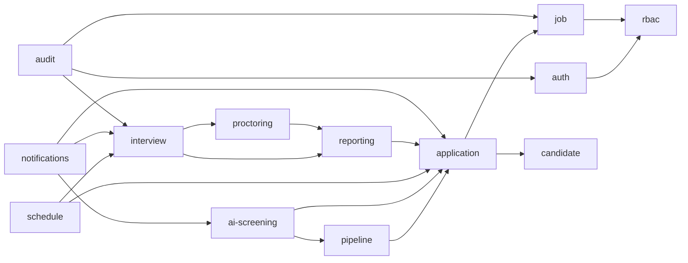
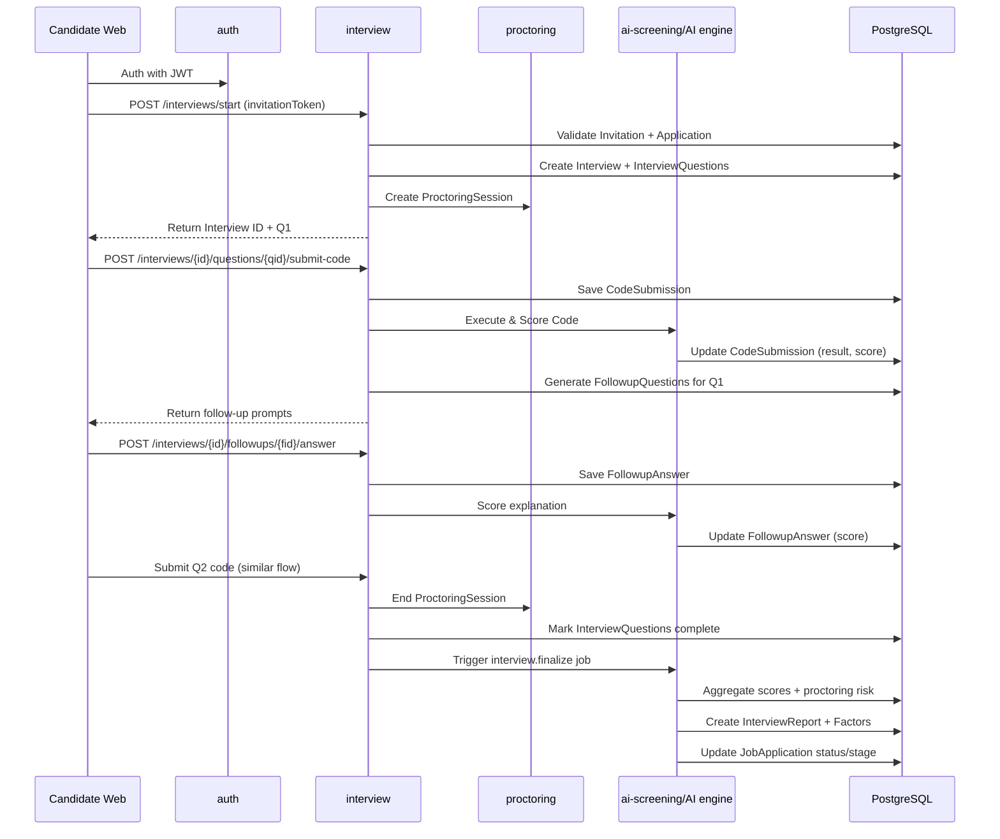

## Backend Low Level Design (LLD) – Recruitment & AI Interview Platform

### 1. Scope
- **Scope**: Concrete backend design for core modules, data models, and API contracts, based on `BRD-Recruitment-AI-Interview-Platform.md` and `db-design.md`.
- **Audience**: Backend engineers implementing services, migrations, and APIs.

---

### 2. Module Structure (Example: Node.js / NestJS style)

- `auth` – authentication, sessions, MFA, email verification, password reset.
- `rbac` – companies, roles, company members, authorization guards.
- `candidate` – candidate profile, resumes, saved jobs.
- `job` – jobs, custom fields, job board listing.
- `application` – job applications, application answers, pipeline tracking.
- `bulk-import` – CSV/Excel ingestion and mapping to candidates/applications.
- `pipeline` – pipeline and stage configuration + orchestration.
- `ai-screening` – resume screening orchestration and integration with AI provider.
- `schedule` – interview invitations and slots.
- `interview` – interview sessions, question assignment, code submissions, follow-up Q&A, manual interviews.
- `proctoring` – proctoring sessions and events, behavioral metrics, risk scoring.
- `reporting` – interview reports, factor breakdown, dashboards.
- `notifications` – email/SMS sending and webhooks.
- `audit` – audit logs and compliance utilities.
- `common` – shared utilities (logging, config, db access, error handling, middleware).

Each module exposes:
- Controller(s): REST endpoints.
- Service(s): business logic.
- Repository/DAO(s): DB access using ORM/query builder.

#### 2.1 Module Interaction Overview

---

### 3. Key Data Models (Mapping to `db-design.md`)

> Note: Names are indicative; adapt to your ORM conventions.

- **Auth & RBAC**
  - `User` → `users`
    - `id: UUID`, `email: string`, `passwordHash: string`, `userType: enum('recruiter','candidate','platform_admin')`, `isActive: boolean`, timestamps.
  - `Company` → `companies`
    - `id`, `name`, `slug`, `brandingConfig: JSONB`, `isActive`, timestamps.
  - `Role` → `roles`
    - `id`, `name: enum('SuperAdmin','Admin','ReadOnly','PlatformAdmin')`, `scope: enum('platform','company')`.
  - `CompanyMember` → `company_members`
    - `id`, `companyId`, `userId`, `roleId`, `invitedByUserId`, `status: enum('invited','active','disabled')`.
  - `UserSession` → `user_sessions`
    - `id`, `userId`, `sessionToken`, `expiresAt`, `isActive`.
  - `EmailVerification` → `email_verifications`
    - `id`, `userId`, `token`, `expiresAt`, `usedAt`.
  - `PasswordReset` → `password_resets`
    - `id`, `userId`, `token`, `expiresAt`, `usedAt`.
  - `MfaMethod` → `mfa_methods`
    - `id`, `userId`, `methodType`, `secretData: JSONB`, `isPrimary`.

- **Candidate & Resumes**
  - `Candidate` → `candidates`
    - `id`, `userId`, `fullName`, `phone`, `college`, `graduationYear`, `extraMetadata: JSONB`.
  - `Resume` → `resumes`
    - `id`, `candidateId`, `storagePath`, `originalFilename`, `parsedText`, `parsedMetadata: JSONB`.
  - `SavedJob` → `saved_jobs`
    - `id`, `candidateId`, `jobId`.

- **Jobs & Applications**
  - `Job` → `jobs`
    - `id`, `companyId`, `title`, `description`, `location`, `employmentType`,
      `isPublished`, `applicationDeadline`, `maxApplications`,
      `resumeCriteria: JSONB`, `customFormSchema: JSONB`,
      `scoringWeightsOverride: JSONB`, `createdByUserId`, `pipelineId`.
  - `JobCustomField` → `job_custom_fields` (if used)
    - `id`, `jobId`, `fieldKey`, `label`, `fieldType`, `isRequired`, `options: JSONB`.
  - `JobApplication` → `job_applications`
    - `id`, `jobId`, `candidateId`, `resumeId`, `status`,
      `currentStageId`, `appliedAt`, `lastStatusAt`, `source`.
  - `ApplicationAnswer` → `application_answers`
    - `id`, `applicationId`, `fieldKey`, `value: JSONB`.

- **Pipelines**
  - `Pipeline` → `pipelines`
    - `id`, `companyId`, `name`, `isDefault`, `definitionMeta: JSONB`.
  - `PipelineStage` → `pipeline_stages`
    - `id`, `pipelineId`, `name`, `type: enum('resume_screening','mcq','ai_interview','manual_interview','offer')`, `orderIndex`, `config: JSONB`.
  - `ApplicationStageProgress` → `application_stage_progress`
    - `id`, `applicationId`, `stageId`, `status: enum('pending','in_progress','passed','failed','skipped')`, `startedAt`, `completedAt`, `notes`.

- **AI Resume Screening & Scheduling**
  - `ResumeScreening` → `resume_screenings`
    - `id`, `applicationId`, `jobId`, `resumeId`, `matchScore: number`, `result: enum('shortlisted','not_shortlisted','manual_review')`, `explanation: JSONB`, `criteriaSnapshot: JSONB`.
  - `InterviewInvitation` → `interview_invitations`
    - `id`, `applicationId`, `interviewType: enum('ai_dsa','mcq','manual')`, `token`, `expiresAt`, `status`.
  - `InterviewSlot` → `interview_slots`
    - `id`, `invitationId`, `scheduledStartAt`, `scheduledEndAt`, `bookedByCandidateAt`, `cancelledAt`, `cancelledBy`, `rescheduleCount`, `noShowCandidate`, `noShowRecruiter`.

- **Interview Engine**
  - `QuestionBankQuestion` → `question_bank_questions`
    - `id`, `companyId`, `jobId?`, `title`, `description`, `starterCode`, `difficulty`, `topics: JSONB`, `maxScore`, `isActive`.
  - `QuestionTestCase` → `question_test_cases`
    - `id`, `questionId`, `input`, `expectedOutput`, `visibility`, `weight`.
  - `Interview` → `interviews`
    - `id`, `applicationId`, `type`, `status`, `startedAt`, `endedAt`, `totalScore`, `riskScore`, `engineMetadata: JSONB`.
  - `InterviewQuestion` → `interview_questions`
    - `id`, `interviewId`, `questionId`, `sequenceNumber`, `assignedAt`, `completedAt`.
  - `CodeSubmission` → `code_submissions`
    - `id`, `interviewQuestionId`, `language`, `code`, `submittedAt`, `executionResult: JSONB`, `testCasesPassed`, `testCasesTotal`, `scoreAwarded`.
  - `FollowupQuestion` → `followup_questions`
    - `id`, `interviewQuestionId`, `prompt`, `factor`, `askedAt`.
  - `FollowupAnswer` → `followup_answers`
    - `id`, `followupQuestionId`, `answerText`, `answerMetadata: JSONB`, `scoreAwarded`, `answeredAt`.
  - `ManualInterview` → `manual_interviews`
    - `id`, `interviewId`, `meetLink`, `recordingPath`, `reviewerUserId`, `reviewNotes`, `decision`, `decisionAt`.

- **Proctoring**
  - `ProctoringSession` → `proctoring_sessions`
    - `id`, `interviewId`, `startedAt`, `endedAt`, `overallRiskScore`, `summary: JSONB`.
  - `ProctoringEvent` → `proctoring_events`
    - `id`, `proctoringSessionId`, `eventType`, `occurredAt`, `details: JSONB`, `weight`.
  - `BehavioralMetric` → `behavioral_metrics`
    - `id`, `proctoringSessionId`, `typingSpeedStats: JSONB`, `idleIntervals: JSONB`, `pasteCount`, `suspicionScore`.

- **Reporting & Integrations**
  - `InterviewReport` → `interview_reports`
    - `id`, `interviewId`, `applicationId`, `overallScore`, `summary`, `aiVersion`, `generatedAt`, `riskScore?`, `riskLevel?`.
  - `InterviewReportFactor` → `interview_report_factors`
    - `id`, `reportId`, `factorName`, `weight`, `score`, `maxScore`.
  - `Notification` → `notifications`
    - `id`, `companyId?`, `userId?`, `channel`, `type`, `templateKey`, `payload: JSONB`, `status`, `sentAt`, `errorMessage?`.
  - `WebhookEvent` → `webhook_events`
    - `id`, `companyId`, `eventType`, `payload: JSONB`, `targetUrl`, `status`, `lastAttemptAt`, `retryCount`.
  - `AuditLog` → `audit_logs`
    - `id`, `companyId?`, `actorUserId?`, `actorRole`, `action`, `entityType`, `entityId`, `metadata: JSONB`, `createdAt`.

---

### 4. Core Backend Flows (Detailed)

#### 4.1 Recruiter Signup & Company Onboarding

- **Endpoint**: `POST /auth/signup-super-admin`
  - Request: `{ email, password, fullName, companyName }`
  - Steps:
    1. Validate and create `User` (type `recruiter`).
    2. Create `Company`.
    3. Create `Role` (`SuperAdmin`) if not seeded.
    4. Create `CompanyMember` with `SuperAdmin` role.
    5. Create `EmailVerification` token and send email via `Notification` service.
    6. Start session and return JWT + company context.

- **Endpoint**: `POST /companies/{companyId}/members/invite`
  - Auth: SuperAdmin/Admin (company scope).
  - Steps:
    1. Create/lookup `User` by email (create inactive if not existing).
    2. Create `CompanyMember` with `status = invited`.
    3. Create invite token (reuse `EmailVerification` or dedicated table).
    4. Send invite email.

#### 4.2 Candidate Apply to Job

- **Endpoint**: `POST /jobs/{jobId}/apply`
  - Request:
    - Candidate details (optional if logged in).
    - `resume` file.
    - `answers: { [fieldKey]: value }`.
  - Steps:
    1. If user not logged in:
       - Create `User` (type `candidate`) and `Candidate`.
    2. Upload file to storage, create `Resume` row.
    3. Create `JobApplication` with status `applied`.
    4. Create `ApplicationAnswer` records from request.
    5. Enqueue async job for resume screening (AI).
    6. Return application id + initial status.

#### 4.3 AI Resume Screening

- **Worker job**: `ai-screening.perform(applicationId)`
  - Steps:
    1. Load `JobApplication`, `Job` (criteria), `Resume`.
    2. Call AI provider with `parsedText` + `resumeCriteria`.
    3. Persist `ResumeScreening` (score, result, explanation, criteriaSnapshot).
    4. If `result = shortlisted`:
       - Create `InterviewInvitation` (type `ai_dsa`, token, expires).
       - Optionally generate default interview slots or allow open scheduling.
       - Update `JobApplication.status` and `ApplicationStageProgress` to stage `ai_interview` with `status = pending`.
       - Enqueue notification(s).
    5. Else update `JobApplication` + `ApplicationStageProgress` as `failed` or `manual_review`.

#### 4.4 Interview Scheduling

- **Endpoint**: `GET /interview-invitations/{token}`
  - Validates token, returns job/application info and available slots.

- **Endpoint**: `POST /interview-invitations/{token}/slots`
  - Request: `{ scheduledStartAt }`
  - Steps:
    1. Validate invite (status, expiry, candidate ownership).
    2. Create `InterviewSlot`, mark invite `status = accepted`.
    3. Update `JobApplication.status = scheduled` and stage progress.
    4. Enqueue reminder notifications.

#### 4.5 Interview Execution (AI DSA)

- **Endpoint**: `POST /interviews/start`
  - Request: `{ invitationToken }`
  - Steps:
    1. Validate token and candidate auth.
    2. Create `Interview` with status `in_progress`.
    3. Select two `QuestionBankQuestion`s based on job/company rules.
    4. Create `InterviewQuestion` records (sequence 1 and 2).
    5. Create `ProctoringSession` (status + start time).
    6. Return interview id and first question payload.

- **Endpoint**: `POST /interviews/{interviewId}/questions/{interviewQuestionId}/submit-code`
  - Request: `{ language, code }`
  - Steps:
    1. Validate interview is in progress and candidate is owner.
    2. Create `CodeSubmission` row.
    3. Dispatch code execution to sandbox/worker:
       - Run against `QuestionTestCase` set.
       - Write `executionResult`, `testCasesPassed`, `testCasesTotal`.
    4. Score submission (code correctness, complexity heuristics, etc.) and set `scoreAwarded`.
    5. If `sequenceNumber == 1`:
       - Generate `FollowupQuestion` prompts (complexity, edge cases, explanation).
       - Return follow-up prompts to client.
    6. If `sequenceNumber == 2`:
       - Mark `InterviewQuestion.completedAt`.
       - If all questions completed, trigger final scoring.

- **Endpoint**: `POST /interviews/{interviewId}/followups/{followupQuestionId}/answer`
  - Request: `{ answerText }`
  - Steps:
    1. Create `FollowupAnswer`.
    2. Call AI to evaluate explanation, set `scoreAwarded`.
    3. When all follow-up questions answered for Q1:
       - Mark question as completed.
       - Return second question payload.

- **Worker job**: `interview.finalize(interviewId)`
  - Aggregates:
    - Scores from `CodeSubmission` and `FollowupAnswer`.
    - Proctoring risk from `ProctoringSession` + `ProctoringEvent`.
    - Score weights from job config or defaults.
  - Writes `Interview.totalScore`, `Interview.riskScore`.
  - Creates `InterviewReport` + `InterviewReportFactor`s.
  - Updates `JobApplication.status` and `ApplicationStageProgress`.
  - Enqueues notification/webhook (interview completed, candidate.passed/failed).

##### 4.6.1 Sequence: Interview Execution (AI DSA)

#### 4.6 Proctoring Events

- **Endpoint**: `POST /proctoring/sessions/{sessionId}/events`
  - Request: `{ eventType, details }`
  - Steps:
    1. Validate session and interview ownership.
    2. Persist `ProctoringEvent`.
    3. Optionally update `BehavioralMetric` aggregates in background.

- **Endpoint**: `POST /proctoring/sessions/{sessionId}/end`
  - Marks session ended and persists summary (aggregate risk score).

---

### 5. Authorization & Tenant Isolation

- Middleware/guards apply on all recruiter APIs:
  - Decode JWT → load `User` and `CompanyMember` (if company route).
  - Check role (SuperAdmin/Admin/ReadOnly) and company ownership of entities (`companyId`).
  - Use repository methods that always filter by `companyId` for multi-tenant tables.
- Candidate APIs:
  - Only allow access to entities the candidate owns (`candidateId` mapped from `User`).

---

### 6. Error Handling & Validation

- Central error type (e.g. `AppError`) with:
  - `code` (e.g. `NOT_FOUND`, `UNAUTHORIZED`, `VALIDATION_ERROR`).
  - HTTP status.
  - Optional `details`.
- Input validation layer (e.g. DTOs with decorators or JSON schema) per endpoint.
- Structured logging with correlation IDs per request; logs include user id, company id, and key entity ids.

---

### 7. Background Jobs & Queues

- Job types:
  - `ai-screening.perform`
  - `interview.finalize`
  - `notifications.send-email`
  - `notifications.send-sms`
  - `webhooks.dispatch`
  - `bulk-import.process-batch`
- Implementation:
  - Use a queue library (e.g. BullMQ / Celery / RQ).
  - Each job is idempotent and logs failures; retries with backoff.

---

### 8. Caching & Optimization

- Cache:
  - Frequently used read-only metadata: job configs, question bank summaries, pipeline configs.
  - HR/recruiter dashboards may use pre-aggregated daily stats or materialized views.
- Rate limiting:
  - Per IP and per user on auth endpoints and interview submission endpoints.

---

### 9. Extensibility Hooks

- **New pipeline stages**:
  - Add new `PipelineStage.type` value and stage handler in pipeline orchestrator.
  - Implement new module (e.g. `mcq`) managing its own tables if needed.
- **Third-party ATS**:
  - Implement additional consumers for `WebhookEvent` to map to vendor-specific APIs.
- **Advanced anti-cheating**:
  - Extend `ProctoringEvent.eventType` and `BehavioralMetric` fields.
  - Add additional scoring factors and reflect them in `InterviewReportFactor`.

---

### 10. Minimal Endpoint List (for Implementation Planning)

- **Auth**: `/auth/signup-super-admin`, `/auth/login`, `/auth/logout`, `/auth/refresh`, `/auth/invite`, `/auth/accept-invite`, `/auth/verify-email`, `/auth/reset-password`.
- **Companies**: `/companies/{id}`, `/companies/{id}/members`, `/companies/{id}/branding`.
- **Jobs**: `/jobs` (CRUD), `/jobs/public` (job board), `/jobs/{id}/config`.
- **Candidates**: `/me` (candidate profile), `/me/applications`, `/me/saved-jobs`.
- **Applications**: `/jobs/{jobId}/apply`, `/applications/{id}`, `/applications/{id}/stage`.
- **Bulk Import**: `/bulk-import/batches`, `/bulk-import/batches/{id}`.
- **Pipelines**: `/companies/{id}/pipelines`, `/pipelines/{id}/stages`.
- **AI Screening**: internal/worker-only endpoints or message handlers.
- **Scheduling**: `/interview-invitations/{token}`, `/interview-invitations/{token}/slots`.
- **Interviews**: `/interviews/start`, `/interviews/{id}`, `/interviews/{id}/questions/{qid}/submit-code`, `/interviews/{id}/followups/{fid}/answer`.
- **Proctoring**: `/proctoring/sessions`, `/proctoring/sessions/{id}/events`, `/proctoring/sessions/{id}/end`.
- **Reports**: `/reports/applications/{applicationId}`, `/reports/jobs/{jobId}`, `/reports/export`.
- **Dashboards**: `/dashboards/recruiter`, `/dashboards/platform-admin`.
- **Notifications & Webhooks**: `/notifications/test`, `/webhooks/config`.
- **Audit**: `/audit-logs` (platform admin/read-only access).

