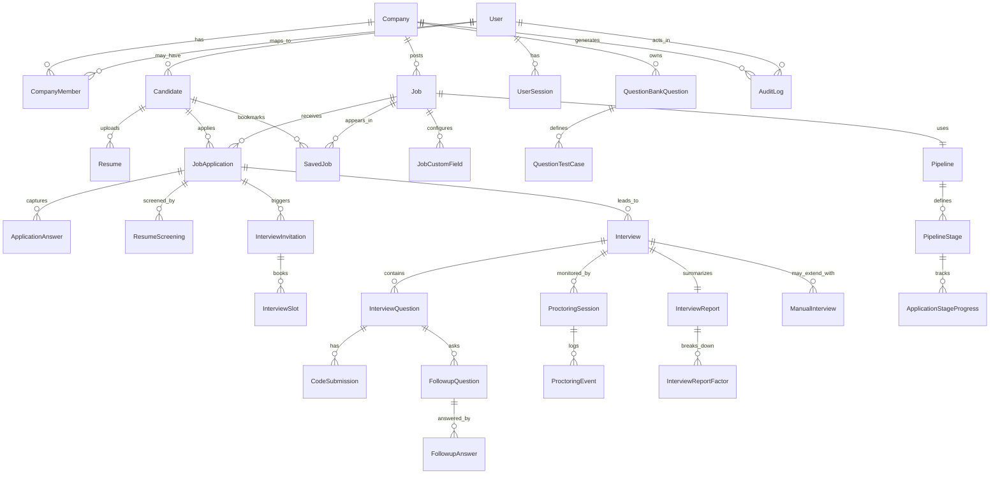
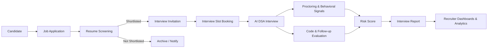

## Recruitment & AI Interview Platform – Database Design

This document describes the relational database design for the Recruitment & AI Interview Platform.  
The design is PostgreSQL-oriented, multi-tenant (per company), and aligned with `BRD-Recruitment-AI-Interview-Platform.md` and the internal schema plan.

---

## High-Level Approach

- **Relational store**: PostgreSQL (or similar) with strict foreign keys and cascading rules where appropriate.
- **Unified user model**: Single `users` table with `user_type` (`recruiter`, `candidate`, `platform_admin`), extended via profile and membership tables.
- **Multi-tenancy**: All recruiter/company-facing entities carry a `company_id` (e.g. `jobs`, `pipelines`, `question_bank_questions`, dashboards, audit logs).
- **Flexible configuration**: Use `JSONB` for:
  - Resume criteria per job (`jobs.resume_criteria`).
  - Custom application forms (`jobs.custom_form_schema`).
  - Scoring weights overrides (`jobs.scoring_weights_override`).
  - AI execution results, test-case results, and proctoring details.
- **Performance-aware**: Indexes on key query dimensions such as `company_id`, `job_id`, `status`, `application_id`, and timestamps like `created_at` / `application_deadline`.

---

## Core Entity Tables

### Auth & RBAC

- **`users`**
  - Global user accounts (recruiters, candidates, platform admins).
  - Key fields: `id`, `email` (unique), `password_hash`, `user_type`, `is_active`, `created_at`, `last_login_at`.
- **`companies`**
  - Tenant/organization definition.
  - Key fields: `id`, `name`, `slug`, `branding_config` (logo/colors/email templates), `is_active`, `created_at`.
- **`roles`**
  - Role definitions for platform and company scope.
  - Key fields: `id`, `name` (`SuperAdmin`, `Admin`, `ReadOnly`, `PlatformAdmin`), `scope` (`platform`/`company`).
- **`company_members`**
  - Links recruiter users to companies with a role.
  - Key fields: `id`, `company_id` FK, `user_id` FK, `role_id` FK, `invited_by_user_id` FK, `status` (invited/active/disabled), `created_at`.
- **`user_sessions`**
  - Login sessions for enforcing single active session per user.
  - Key fields: `id`, `user_id` FK, `session_token`, `expires_at`, `is_active`, `created_at`.
- **`email_verifications`**
  - Email verification tokens for new accounts.
  - Key fields: `id`, `user_id` FK, `token`, `expires_at`, `used_at`.
- **`password_resets`**
  - Secure password reset tokens.
  - Key fields: `id`, `user_id` FK, `token`, `expires_at`, `used_at`.
- **`mfa_methods`**
  - Optional MFA setup per recruiter.
  - Key fields: `id`, `user_id` FK, `method_type`, `secret_data` (JSONB), `is_primary`, `created_at`.

---

### Candidate Data

- **`candidates`**
  - Extended profile for candidate-type users.
  - Key fields: `id`, `user_id` FK (`users.user_type = candidate`), `full_name`, `phone`, `college`, `graduation_year`, `extra_metadata` (JSONB), `created_at`.
- **`resumes`**
  - Uploaded and parsed resumes.
  - Key fields: `id`, `candidate_id` FK, `storage_path`, `original_filename`, `parsed_text`, `parsed_metadata` (JSONB), `created_at`.
- **`saved_jobs`**
  - Candidate “save for later” job bookmarks.
  - Key fields: `id`, `candidate_id` FK, `job_id` FK, `created_at` (unique on `candidate_id` + `job_id`).
- **`bulk_import_batches`**
  - Metadata for recruiter CSV/Excel bulk uploads.
  - Key fields: `id`, `company_id` FK, `uploaded_by_user_id` FK, `source_file_path`, `status` (processing/completed/failed), `created_at`.
- **`bulk_import_candidates`**
  - Per-row representation of imported candidates.
  - Key fields: `id`, `batch_id` FK, `candidate_email`, `candidate_name`, `college`, `linked_candidate_id` FK (nullable), `job_id` FK (nullable), `status`, `created_at`.

---

### Jobs, Applications & Pipeline

- **`jobs`**
  - Job postings on the job board.
  - Key fields: `id`, `company_id` FK, `title`, `description`, `location`, `employment_type`, `is_published`,
    `application_deadline`, `max_applications`, `resume_criteria` (JSONB), `custom_form_schema` (JSONB),
    `scoring_weights_override` (JSONB), `created_by_user_id` FK, `pipeline_id` FK (optional), `created_at`, `updated_at`.
- **`job_custom_fields`** (optional normalization)
  - Structured definition of per-job custom fields.
  - Key fields: `id`, `job_id` FK, `field_key`, `label`, `field_type`, `is_required`, `options` (JSONB).
- **`job_applications`**
  - Applications submitted by candidates to specific jobs.
  - Key fields: `id`, `job_id` FK, `candidate_id` FK, `resume_id` FK, `status` (applied/screened/invited/scheduled/interviewed/reported/rejected/hired),
    `current_stage_id` FK (`pipeline_stages`), `applied_at`, `last_status_at`, `source` (job_board/bulk_import/ats_api).
- **`application_answers`**
  - Captures responses to custom fields per application.
  - Key fields: `id`, `application_id` FK, `field_key`, `value` (JSONB), `created_at`.
- **`pipelines`**
  - Configurable hiring pipelines per company.
  - Key fields: `id`, `company_id` FK, `name`, `is_default`, `definition_meta` (JSONB), `created_at`.
- **`pipeline_stages`**
  - Ordered stages in a pipeline.
  - Key fields: `id`, `pipeline_id` FK, `name`, `type` (resume_screening/mcq/ai_interview/manual_interview/offer),
    `order_index`, `config` (JSONB).
- **`application_stage_progress`**
  - Per-application tracking across stages.
  - Key fields: `id`, `application_id` FK, `stage_id` FK, `status` (pending/in_progress/passed/failed/skipped),
    `started_at`, `completed_at`, `notes`.

---

### AI Resume Screening & Scheduling

- **`resume_screenings`**
  - AI resume matching against job criteria.
  - Key fields: `id`, `application_id` FK, `job_id` FK, `resume_id` FK, `match_score` (0–100),
    `result` (shortlisted/not_shortlisted/manual_review), `explanation` (JSONB), `criteria_snapshot` (JSONB), `created_at`.
- **`interview_invitations`**
  - Invitation artifacts connecting an application to an interview link/flow.
  - Key fields: `id`, `application_id` FK, `interview_type` (ai_dsa/mcq/manual), `token`,
    `expires_at`, `status` (pending/accepted/cancelled/expired), `created_at`.
- **`interview_slots`**
  - Time slots booked or rescheduled by candidates.
  - Key fields: `id`, `invitation_id` FK, `scheduled_start_at`, `scheduled_end_at`,
    `booked_by_candidate_at`, `cancelled_at`, `cancelled_by` (candidate/recruiter/system),
    `reschedule_count`, `no_show_candidate` (bool), `no_show_recruiter` (bool).

---

### Question Bank & Interview Engine

- **`question_bank_questions`**
  - Company/job-scoped DSA questions.
  - Key fields: `id`, `company_id` FK, `job_id` FK (nullable), `title`, `description`, `starter_code`,
    `difficulty` (easy/med/hard), `topics` (JSONB), `max_score`, `is_active`, `created_at`.
- **`question_test_cases`**
  - Test cases for each coding question.
  - Key fields: `id`, `question_id` FK, `input`, `expected_output`, `visibility` (public/hidden),
    `weight`, `created_at`.
- **`interviews`**
  - Individual interview sessions per application.
  - Key fields: `id`, `application_id` FK, `type` (ai_dsa/mcq/manual), `status` (scheduled/in_progress/completed/cancelled),
    `started_at`, `ended_at`, `total_score`, `risk_score`, `engine_metadata` (JSONB), `created_at`.
- **`interview_questions`**
  - The concrete questions assigned during an interview.
  - Key fields: `id`, `interview_id` FK, `question_id` FK, `sequence_number`, `assigned_at`, `completed_at`.
- **`code_submissions`**
  - Candidate code attempts for each interview question.
  - Key fields: `id`, `interview_question_id` FK, `language`, `code`, `submitted_at`,
    `execution_result` (JSONB), `test_cases_passed`, `test_cases_total`, `score_awarded`.
- **`followup_questions`**
  - Authenticity follow-up prompts about the candidate’s own solution.
  - Key fields: `id`, `interview_question_id` FK, `prompt`, `factor` (complexity/edge_cases/explanation_quality),
    `asked_at`.
- **`followup_answers`**
  - Candidate responses to follow-up questions.
  - Key fields: `id`, `followup_question_id` FK, `answer_text`, `answer_metadata` (JSONB),
    `score_awarded`, `answered_at`.
- **`manual_interviews`**
  - Extra metadata for human manual interview rounds.
  - Key fields: `id`, `interview_id` FK (type=manual), `meet_link`, `recording_path`,
    `reviewer_user_id` FK, `review_notes`, `decision` (pass/fail), `decision_at`.

---

### Proctoring & Anti-Cheating

- **`proctoring_sessions`**
  - Per-interview proctoring session summary.
  - Key fields: `id`, `interview_id` FK, `started_at`, `ended_at`,
    `overall_risk_score`, `summary` (JSONB), `created_at`.
- **`proctoring_events`**
  - Individual proctoring violations or events.
  - Key fields: `id`, `proctoring_session_id` FK, `event_type` (screen_switch/tab_switch/devtools_open/copy_event/inactivity/paste_detection),
    `occurred_at`, `details` (JSONB), `weight`.
- **`behavioral_metrics`** (optional advanced layer)
  - Aggregated behavioral signals for anti-cheating.
  - Key fields: `id`, `proctoring_session_id` FK, `typing_speed_stats` (JSONB),
    `idle_intervals` (JSONB), `paste_count`, `suspicion_score`.

---

### Reporting & Integrations

- **`interview_reports`**
  - Final report per interview for recruiters and candidates.
  - Key fields: `id`, `interview_id` FK, `application_id` FK, `overall_score` (0–100),
    `summary`, `ai_version`, `generated_at`.
  - Optional fields: `risk_score` / `risk_level` derived from `proctoring_sessions` and reflected in `interview_report_factors`.
- **`interview_report_factors`**
  - Factor-wise breakdown of the report score.
  - Key fields: `id`, `report_id` FK, `factor_name`
    (code_correctness/complexity/test_coverage/code_quality/explanation_quality/proctoring_risk),
    `weight`, `score`, `max_score`.
- **`notifications`**
  - Outbound communication across email/SMS/webhook.
  - Key fields: `id`, `company_id` FK (nullable), `user_id` FK (nullable),
    `channel` (email/sms/webhook), `type` (invite/reminder/status_update),
    `template_key`, `payload` (JSONB), `status` (pending/sent/failed),
    `sent_at`, `error_message`, `created_at`.
- **`webhook_events`**
  - Webhook queue for ATS/HRIS and external integrations.
  - Key fields: `id`, `company_id` FK, `event_type` (candidate.applied/resume.shortlisted/interview.completed/candidate.passed/candidate.failed),
    `payload` (JSONB), `target_url`, `status` (pending/sent/failed),
    `last_attempt_at`, `retry_count`, `created_at`.
- **`audit_logs`**
  - Immutable audit trail for sensitive/platform actions.
  - Key fields: `id`, `company_id` FK (nullable), `actor_user_id` FK (nullable),
    `actor_role`, `action` (job_created/role_changed/report_viewed/export_run/etc.),
    `entity_type` (job/application/user/company/interview), `entity_id`,
    `metadata` (JSONB), `created_at`.

---

## Indexes & Performance Notes

- **Tenant & listing filters**
  - `jobs`: composite index on (`company_id`, `is_published`) for job board queries.
  - `jobs`: index on `application_deadline` for filtering closed vs open roles.
- **Funnel & reporting queries**
  - `job_applications`: composite index on (`job_id`, `status`) for stage-wise counts.
  - `job_applications`: composite index on (`candidate_id`, `job_id`) for dedup and history.
  - `resume_screenings`, `interviews`, `interview_reports`: indexes on `application_id` to quickly join application → screening → interview → report.
- **Common analytics indexes**
  - `job_applications`: index on `applied_at` (or `created_at`) for time-series KPI and dashboard queries.
  - `interviews`: index on `created_at` and/or `started_at` for throughput and completion tracking.
  - `interview_reports`: index on `generated_at` for reporting volume and trend analytics.
- **Auth flows**
  - `users`: unique index on `email` for login.
  - `user_sessions`: index on `user_id` for enforcing single-session and invalidating old sessions.
- **Write vs read trade-offs**
  - Use JSONB for flexible criteria and payloads to avoid schema churn.
  - Add additional specific indexes only when query patterns stabilize (e.g. GIN index on JSONB if needed for filtering on tags/skills).

---

## ER Diagram (Mermaid)

## Candidate Journey Overview (Mermaid)

---

## Extensibility & Future Scope

- **Additional stages and pipelines**
  - `pipelines` and `pipeline_stages` allow adding/removing/reordering stages (e.g. multiple MCQ rounds, skipping AI interview for some roles) without schema changes.
- **Manual interviews & recordings**
  - `manual_interviews` supports storing Meet links, recordings, and pass/fail decisions tied to `interviews` of type `manual`.
- **Advanced anti-cheating**
  - `behavioral_metrics` and detailed `proctoring_events` allow future behavioral models, plagiarism integrations, and enhanced risk scoring.
- **Enterprise integrations**
  - `webhook_events` and `notifications` provide hooks for ATS/HRIS integrations, email/SMS providers, and custom enterprise dashboards without touching core tables.

